# 🌍 Terra-Agent: Hybrid-AI Agentic GIS

**Terra-Agent** is a local-first platform for autonomous real estate due diligence. It bridges the gap between **Massive Cloud Data** and **Private Local Documents** using a hybrid AI architecture.

### 🚀 The "Hybrid AI" Workflow
1.  **Batch (Spark):** Normalizes 10+ years of historical land prices into Snowflake.
2.  **Streaming (Flink):** Ingests real-time zoning changes and updates Snowflake instantly.
3.  **Cloud AI (Snowflake Cortex):** Automatically generates summaries and sentiment scores for every land record inside the warehouse.
4.  **Local AI (Ollama + LlamaIndex):** A local agent performs RAG on private PDF deeds and synthesizes a final report by "talking" to the Snowflake AI insights.

### 🛠 Tech Stack
-   **Data Engine:** Apache Spark (Batch), Apache Flink (Streaming).
-   **Orchestrator:** Apache Airflow.
-   **Warehouse AI:** Snowflake Cortex (LLM Summarization & Sentiment).
-   **Local Brain:** Ollama (Llama3) + LlamaIndex (Private RAG).
-   **Frontend:** Streamlit.

### 📈 System Comparison
| Feature | Legacy GIS | Terra-Agent |
| :--- | :--- | :--- |
| **Data Update** | Monthly/Manual | **Real-time (Flink)** |
| **Intelligence** | Human Reading | **Snowflake Cortex (Cloud AI)** |
| **Privacy** | Upload everything to Cloud | **Local-First (Sensitive docs stay local)** |
| **Reasoning** | Static Dashboards | **Agentic (LangChain/LlamaIndex)** |

### 🛠 Quick Start
1. **Configure Snowflake:** Run the SQL script in `snowflake_setup.sql` to enable Cortex AI views.
2. **Launch Infrastructure:**
   ```bash
   docker-compose up -d

Flink
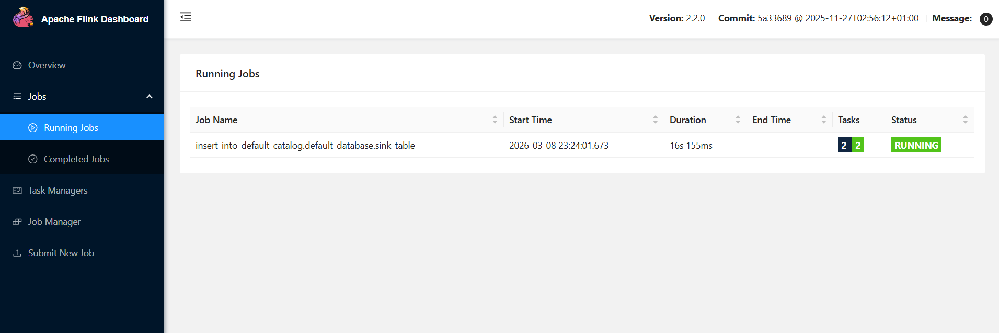
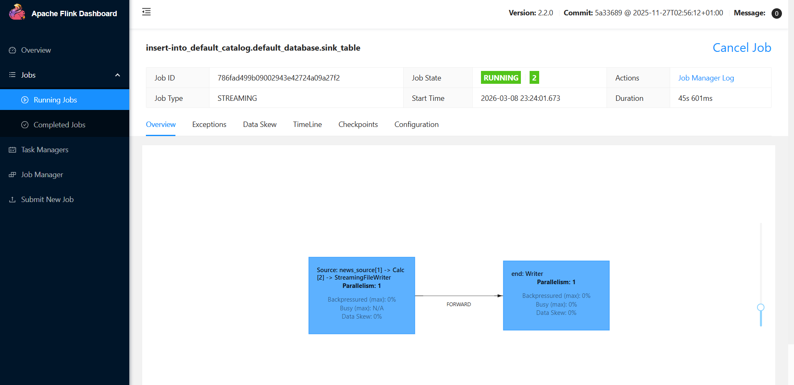

Airflow
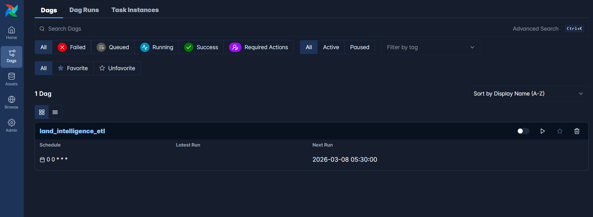
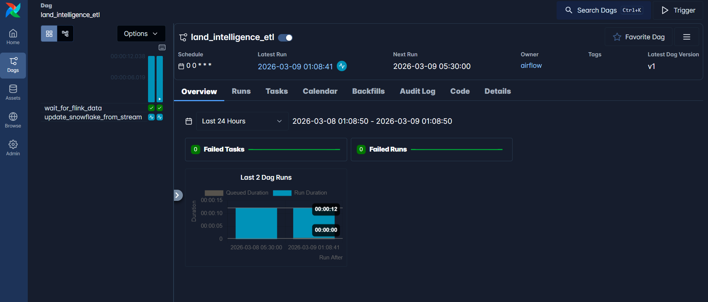

Snowflake
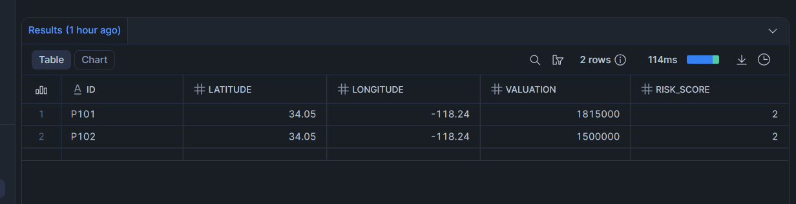
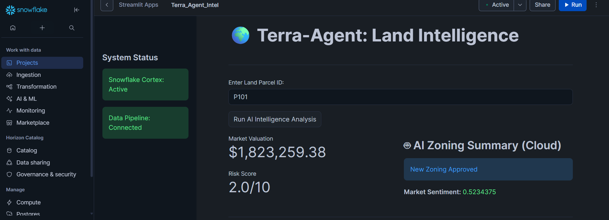

Spark
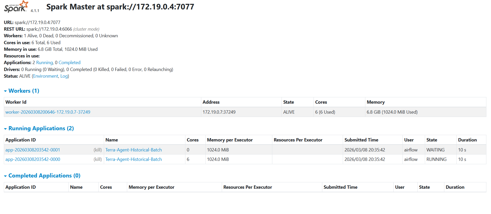

Agent
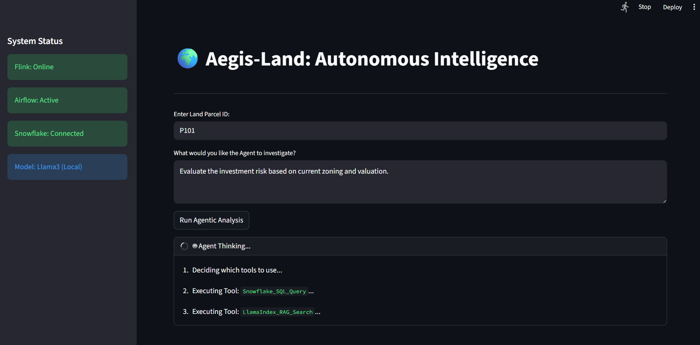
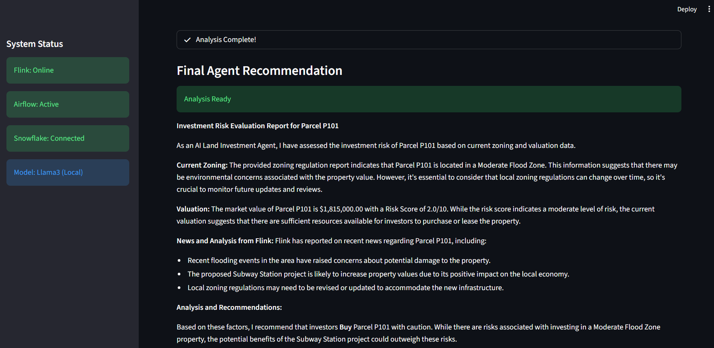
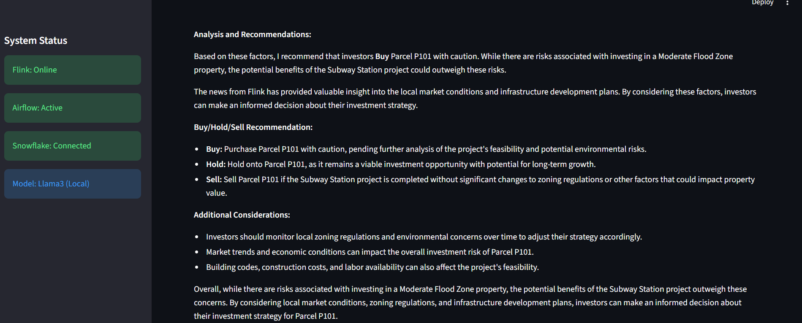
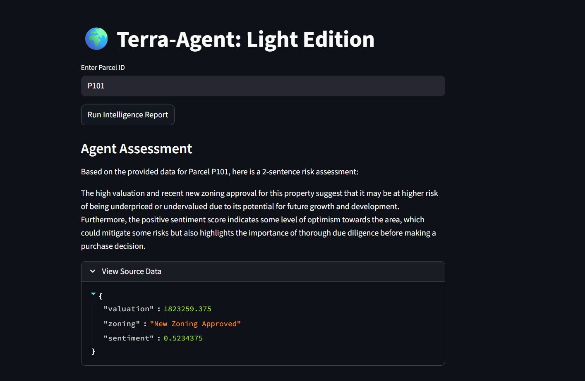